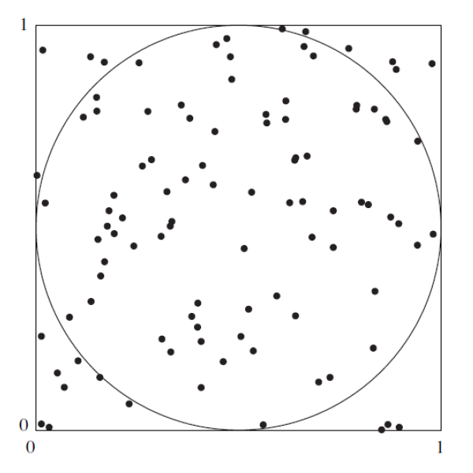

<style type="text/css">
  body {
    font-size: 16px;
    font-family: Arial, sans-serif;
  }
}
</style>
```{r setup, include=FALSE}
knitr::opts_chunk$set(echo = TRUE)
library(dplyr)
library(plotly)
library(ggplot2)
library(tidyr)
library(DT)
```
## Problema 1
### Estimación del valor de $\pi$
La siguiente figura sugiere como estimar el valor de **$\pi$** con una simulación. En la figura, un circuito con un área igual a **$\pi/4$**, está inscrito en un cuadrado cuya área es igual a 1. Se elige de forma aleatoria **$n$** puntos dentro del cuadrado. La probabilidad de que un punto esté dentro del círculo es igual a la fracción del área del cuadrado que abarca a este, la cual es **$\pi/4$**. Por tanto, se puede estimar el valor de **$\pi/4$** al contar el número de puntos dentro del círculo, para obtener la estimación de **$\pi/4$**. De este último resultado se encontrar una aproximación para el valor de **$\pi$**.

<div style="text-align: center">

</div>


Pasos sugeridos:

Genere n coordenadas $x: X1, . . . , Xn$. Utilice la distribución uniforme con valor mínimo de 0 y valor máximo de 1. La distribución uniforme genera variables aleatorias que tienen la misma probabilidad de venir de cualquier parte del intervalo (0,1).

Genere 1000 coordenadas $y: Y1,...,Yn$, utilizando nuevamente la distribución uniforme con valor mínimo de 0 y valor máximo de 1.

### Datos simulación

```{r}
set.seed(123)
n1 <- 1000
n2 <- 10000
n3 <- 100000
x_1000 <- runif(n1, 0, 1)
y_1000 <- runif(n1, 0, 1)

x_10000 <- runif(n2, 0, 1)
y_10000 <- runif(n2, 0, 1)

x_100000 <- runif(n3, 0, 1)
y_100000 <- runif(n3, 0, 1)
```

Cada punto (Xi,Yi) se encuentra dentro del círculo si su distancia desde el centro (0.5,0.5) es menor a 0.5. Para cada par (Xi,Yi) determine si la distancia desde el centro es menor a 0.5. Esto último se puede realizar al calcular el valor (Xi−0.5)2+(Yi−0.5)2, que es el cuadrado de la distancia, y al determinar si es menor que 0.25.

### Respuestas

**¿Cuántos de los puntos están dentro del círculo?**
```{r}
puntos_dentro_1000 <- sum((x_1000 - 0.5)^2 + (y_1000 - 0.5)^2 <= 0.25)
puntos_dentro_10000 <- sum((x_10000 - 0.5)^2 + (y_10000 - 0.5)^2 <= 0.25)
puntos_dentro_100000 <- sum((x_100000 - 0.5)^2 + (y_100000 - 0.5)^2 <= 0.25)
```
El número de puntos dentro del círculo es de: **`r puntos_dentro_1000`**

**¿Cuál es su estimación de $\pi$?**

$\pi = 4 \times \frac{\text{puntos dentro}}{n}$

```{r}
pi_estimado_1000 <- 4 * puntos_dentro_1000 / n1
pi_estimado_10000 <- 4 * puntos_dentro_10000 / n2
pi_estimado_100000 <- 4 * puntos_dentro_100000 / n3
```

La estimación de **$\large\pi$** con **$\large n=`r n1`$** es de: **`r pi_estimado_1000`**

La estimación de **$\large\pi$** con **$\large n=`r n2`$** es de: **`r pi_estimado_10000`**

La estimación de **$\large\pi$** con **$\large n=`r n3`$** es de: **`r pi_estimado_100000`**

**¿Cuál es el error absoluto de su estimación?**

$\Large|\pi - \pi_{estimado}|$

```{r}
error_absoluto_1000 <- abs(pi - pi_estimado_1000)
error_absoluto_10000 <- abs(pi - pi_estimado_10000)
error_absoluto_100000 <- abs(pi - pi_estimado_100000)
```

Error absoluto para muestra de **$n=`r n1`$** : **$`r error_absoluto_1000`$**

Error absoluto para muestra de **$n=`r n3`$** : **$`r error_absoluto_10000`$**

Error absoluto para muestra de **$n=`r n2`$** :  **$`r error_absoluto_100000`$**

**¿Cuál es el error relativo de su estimación?**

$\Large\frac{|\pi - \pi_{estimado}|}{\pi} = \frac{|\pi - `r pi_estimado_1000`|}{\pi}$

```{r}
error_relativo_1000 <- abs(pi - pi_estimado_1000) / pi
error_relativo_10000 <- abs(pi - pi_estimado_10000) / pi
error_relativo_100000 <- abs(pi - pi_estimado_100000) / pi
```

Error relativo para muestra de **$n=`r n1`$** : **$`r error_relativo_1000`$**

Error relativo para muestra de **$n=`r n3`$** : **$`r error_relativo_10000`$**

Error relativo para muestra de **$n=`r n2`$** :  **$`r error_relativo_100000`$**


## Problema 2 
### Propiedades de los estimadores

La simulación ayuda a entender y validad las propiedades de los estimadores estadísticos como son. insesgadez, eficiencia y la consistencia principalmente. El siguiente problema permite evidenciar las principales características de un grupo de estimadores propuestos para la estimación de un parámetro asociado a un modelo de probabilidad.

Sean $X1, X2, X3 \,y\, X4$, una muestra aleatoria de tamaño **$n=4$** cuya población la conforma una distribución exponencial con parámetro $\theta$ desconocido. Determine las características de cada uno de los siguientes estimadores propuestos:

1. $\hat{\theta}_1 = \frac{X_1 + X_2}{6} + \frac{X_3 + X_4}{3}$

1. $\hat{\theta}_2 = \frac{X_1 + 2X_2 + 3X_3 + 4X_4}{5}$

1. $\hat{\theta}_3 = \frac{X_1 + X_2 + X_3 + X_4}{4}$

1. $\hat{\theta}_4 = \frac{\min\{X_1, X_2, X_3, X_4\} + \max\{X_1, X_2, X_3, X_4\}}{2}$

### Formulación de la simulación

```{r}
n <- 4
m = 5000
lam <- 0.5

rep = rexp(m*n,rate = lam)
df = data.frame(matrix(rep,nrow = m, ncol = n, byrow = TRUE))

estimador1 <- function(m) { ((m[1] + m[2]) / 6) + ((m[3] + m[4]) / 3) }
estimador2 <- function(m) { (m[1] + 2*m[2] + 3*m[3] + 4*m[4]) / 5 }
estimador3 <- function(m) { mean(m) }
estimador4 <- function(m) { (min(m) + max(m)) / 2 }

estimarMuestra <- function(data, n_muestra, lam) {
  teta <- 1 / lam
  muestra <- data[sample(nrow(df), size=n_muestra), ]
  t1 <- apply(muestra, 1, estimador1)
  t2 <- apply(muestra, 1, estimador2)
  t3 <- apply(muestra, 1, estimador3)
  t4 <- apply(muestra, 1, estimador4)
  return(data.frame(t1, t2, t3, t4))
}
calcularMetricas <- function(datos, n_muestra, lam) {
  teta <- 1 / lam
  media <- apply(datos, 2, mean)
  varianza <- apply(datos, 2, var)
  sesgo <- media - teta
  return (data.frame(media = media, varianza = varianza, n=n_muestra, sesgo=sesgo))
}

obtenerGrafica <- function(datos, n_muestra, lam) {
  teta <- 1 / lam
  d <- pivot_longer(datos, cols = c(t1, t2, t3, t4), names_to = "categoria", values_to = "valor")
  bp <- ggplot(d, aes(x = categoria, y = valor, fill = categoria)) +
    geom_boxplot() +
    geom_hline(yintercept = teta, color = "red", linetype = "dashed", linewidth = 1) +
    scale_fill_manual(values = c("#377eb8", "#ff7f00", "#4daf4a", "#f781bf")) +
    labs(title = paste("m =", n_muestra), x = "Categoría", y = "Valor") +
    theme_minimal() 
  bp <- ggplotly(bp)
  return (bp)
}
```

```{r, echo=FALSE}
d <- estimarMuestra(df, 20, lam)
calculos20 <- calcularMetricas(d, 20, lam)
obtenerGrafica(d, 20, lam)

d <- estimarMuestra(df, 50, lam)
calculos50 <- calcularMetricas(d, 50, lam)
obtenerGrafica(d, 50, lam)

d <- estimarMuestra(df, 100, lam)
calculos100 <- calcularMetricas(d, 100, lam)
obtenerGrafica(d, 100, lam)

d <- estimarMuestra(df, 1000, lam)
calculos1000 <- calcularMetricas(d, 1000, lam)
obtenerGrafica(d, 1000, lam)
```

### Resultados m=20

```{r, echo=FALSE}
datatable(calculos20, options = list(pageLength = 20, dom = 't'))
```

### Resultados m=50

```{r, echo=FALSE}
datatable(calculos50, options = list(pageLength = 20, dom = 't'))
```

### Resultados m=100

```{r, echo=FALSE}
datatable(calculos100, options = list(pageLength = 20, dom = 't'))

```

### Resultados m=1000

```{r, echo=FALSE}
datatable(calculos1000, options = list(pageLength = 20, dom = 't'))
```

### Conclusiones

* Podemos ver que $\hat\theta_1$ y $\hat\theta_3$ son insesgados, eficientes y consistentes para las muestras $n = 20$, $n = 50$,$n = 100$ y $n = 1000$.
* Para $\hat\theta_4$ es insesgado, eficiente y consistente para las muestras $n > 100$.
* El estimador $\hat\theta_2$ para sus tres indicadores es muy grande, aunque se ve que comienza a mejorar a medida que el tamaño de la muestra aumenta.

## Problemas 3
### Teorema del Límite Central

El Teorema del Límite Central es uno de los más importantes en la inferencia estadística y habla sobre la convergencia de los estimadores como la proporción muestral a la distribución normal. Algunos autores afirman que esta aproximación es bastante buena a partir del umbral $n>30$.

A continuación se describen los siguientes pasos para su verificación:

a) Realice una simulación en la cual genere una población de $n=1000$ (Lote), donde el porcentaje de individuos (supongamos plantas) enfermas sea del 50%.
a) Genere una función que permita obtener una muestra aleatoria de la población y Calcule el estimador de la proporción muestral $\hat p$ para un tamaño de muestra dado $n$.
a) Repita el escenario anterior $(b)n=500$ veces y analice los resultados en cuanto al comportamiento de los 500
 resultados del estimador $\hat p$. ¿Qué tan simétricos o sesgados son los resultados obtenidos? y ¿qué se puede observar en cuanto a la variabilidad?. Realice en su informe un comentario sobre los resultados obtenidos.
a) Repita los puntos b y c para tamaños de muestra $n=5, 10, 15, 20, 30, 50, 60, 100, 200, 500$. Compare los resultados obtenidos para los diferentes tamaños de muestra en cuanto a la normalidad. Utilice pruebas de bondad y ajuste (shapiro wilks :shspiro.test()) y métodos gráficos (gráfico de normalidad: qqnorm()). Comente en su informe los resultados obtenidos.
a) Repita toda la simulación (puntos a – d), pero ahora para lotes con 10% de plantas enfermas y de nuevo para lotes con un 90% de plantas enfermas. Concluya sobre los resultados del ejercicio.

### Formulación de la simulación
#### a. Generando muestra 50-50

```{r}
generador_valores <- function(n, porcentaje1, procentaje2) {
  p_sano <- round(n * porcentaje1)
  p_enfermo <- round(n * procentaje2)
  estado <- c(rep("sana", p_sano), rep("enferma", p_enfermo))
  return(estado)
}
lote <- generador_valores(1000, 0.5, 0.5)
```


#### b. funcion que permita obtener una muestra aleatoria de la población y Calcule el estimador de la proporción muestral $\hat p$ para un tamaño de muestra dado $n$.

```{r}

generarMuestra <- function(lote, n) {
  muestra <- sample(lote, n)
  return(muestra)
}
calcularProporcion <- function(lote, n, estado) {
  muestra <- generarMuestra(lote, n)
  P <- sum(muestra == estado) / n
  return(P)
}

```

```{r}
proporcion <- calcularProporcion(lote, 10, "enferma")
```

```{r}
set.seed(123)
n <- 500
resultados <- replicate(500, calcularProporcion(lote, 100, "enferma"))
hist(resultados, col="#377eb8", main = paste("Histograma de la muestra n =", n), xlab="Probabilidad de las muestras", ylab="Frecuencia", las=1, font.axis=4)
abline (v=mean(resultados), lwd = 4, lty = 2, col="#ff7f00")
```

**¿Qué tan simétricos o sesgados son los resultados obtenidos?**

**¿qué se puede observar en cuanto a la variabilidad?**


### Repita los puntos b y c para
```{r, fig.width=20, fig.height=10}
iterador <- c(5, 10, 15, 20, 30, 50, 60, 100, 200, 500)
set.seed(123)
for(n in iterador) {
  resultados <- replicate(n, calcularProporcion(lote, 100, "enferma"))
  par(mfrow=c(1,2))
  hist(resultados, col="#377eb8", main = paste("Histograma de la muestra n =", n), xlab="Probabilidad de las muestras", ylab="Frecuencia", las=1, font.axis=4)
  abline (v=mean(resultados), lwd = 4, lty = 2, col="#ff7f00")
  shapiroRes <- shapiro.test(resultados)
  print(shapiroRes)
  qqnorm(resultados, col = "#377eb8")
  qqline(resultados, col = "#ff7f00")
}
```


```{r}
set.seed(123)
lote <- generador_valores(1000, 0.9, 0.1)
iterador <- c(5, 10, 15, 20, 30, 50, 60, 100, 200, 500)
for(n in iterador) {
  resultados <- replicate(n, calcularProporcion(lote, 100, "enferma"))
  par(mfrow=c(1,2))
  hist(resultados, col="#377eb8", main = paste("Histograma de la muestra n =", n), xlab="Probabilidad de las muestras", ylab="Frecuencia", las=1, font.axis=4)
  abline (v=mean(resultados), lwd = 4, lty = 2, col="#ff7f00")
  qqnorm(resultados, col = "#377eb8", main = paste("QQ de la muestra n =", n))
  qqline(resultados, col = "#ff7f00")
  shapiroRes <- shapiro.test(resultados)
  print(shapiroRes)
}
```
### Repita toda la simulación (puntos a – d),

```{r}
set.seed(123)
lote <- generador_valores(1000, 0.1, 0.9)
iterador <- c(5, 10, 15, 20, 30, 50, 60, 100, 200, 500)

for(n in iterador) {
  resultados <- replicate(n, calcularProporcion(lote, 100, "enferma"))
  par(mfrow=c(1,2))
  hist(resultados, col="#377eb8", main = paste("Histograma de la muestra n =", n), xlab="Probabilidad de las muestras", ylab="Frecuencia", las=1, font.axis=4)
  abline (v=mean(resultados), lwd = 4, lty = 2, col="#ff7f00")
  shapiroRes <- shapiro.test(resultados)
  print(shapiroRes)
  qqnorm(resultados, col = "#377eb8")
  qqline(resultados, col = "#ff7f00")
}
```

## Problema 4
### Estimacción boostrap


Cuando se extrae una muestra de una población que no es normal y se requiere estimar un intervalo de confianza se pueden utilizar los métodos de estimación bootstrap. Esta metodología supone que se puede reconstruir la población objeto de estudio mediante un muestreo con reemplazo de la muestra que se tiene. Existen varias versiones del método. Una presentación básica del método se describe a continuación:


El artículo de In-use Emissions from Heavy Duty Dissel Vehicles (J.Yanowitz, 2001) presenta las mediciones de eficiencia de combustible en millas/galón de una muestra de siete camiones. Los datos obtenidos son los siguientes: **7.69, 4.97, 4.56, 6.49, 4.34, 6.24 y 4.45**. Se supone que es una muestra aleatoria de camiones y que se desea construir un intervalo de confianza del 95 % para la media de la eficiencia de combustible de esta población. No se tiene información de la distribución de los datos. El método bootstrap permite construir intervalos de confianza del 95% - Para ilustrar el método suponga que coloca los valores de la muestra en una caja y extrae uno al azar. Este correspondería al primer valor de la muestra bootstrap $X^∗_1$. Después de anotado el valor se regresa $X^∗_1$ a la caja y se extrae el valor $X^∗_2$, regresandolo nuevamente. Este procedimiento se repite hasta completar una muestra de tamaño $n, X^*_1, X^∗_2,X^∗_3,X^*_n$, conformando la muestra bootstrap.

Es necesario extraer un gran número de muestras (suponga k = 1000). Para cada una de las muestra bootstrap obtenidas se calcula la media $X^∗_i$, obteniéndose un valor para cada muestra. El intervalo de confianza queda conformado por los percentiles $P_{2.5}$ y $P{9_7.5}$. Existen dos métodos para estimarlo:

---

Metodo 1: <div align="center">$(P_2.5;P_97.5)$</div>

---

Metodo 2: <div align="center">$2\bar{X}-P_{97.5};2\bar{X} - P_{2.5}$</div>

---

Construya el intervalo de confianza por los dos métodos y compare los resultados obtenidos. Comente los resultados. Confiaría en estas estimaciones?


### Generación muestra

```{r}
set.seed(123)
k=1000
X=c(7.69, 4.97, 4.56, 6.49, 4.34, 6.24, 4.45)
n=length(X)
boostrap = sample(X, replace = TRUE, size = n*k)
matriz = matrix(boostrap, nrow = 1000, ncol = 7, byrow = TRUE)
matriz = apply(matriz, 1, mean)
promedioTotal = mean(matriz)
```

### Metodo 1

```{r}
m1 <- quantile(matriz, probs = c(0.025, 0.975))
m1
```

### Metodo 2

```{r}
metodo2 = function(promedioTotal, percentiles) {
  return(c(2*promedioTotal - percentiles[2], 2*promedioTotal - percentiles[1]))
}

m2 = metodo2(promedioTotal, m1)
m2
```

```{r}
hist(matriz, las=1, main="Histograma muestra", ylab = " ", xlab = " ", col="#4daf4a")
abline(v=m1, col="#f781bf",lwd=2)
abline(v=m2, col="#ff7f00",lwd=2)
```

### Conclusiones

Ambos métodos son una buena forma para calcular el intervalo de confianza, inclusive gráficamente se puede ve que ambos contienen el 95% de los datos. Pero el mejor método para usar seria el **método 1**.

* El método 1 no asume que la muestra es simétrica, es decir, no asume que la distribución es normal. Por lo que esta es una buena alternativa si tenemos muestras que skewness > 0 o skewness < 0.

* El método 2 para esta muestra tiene una distribución normal es una mejor alternativa que el método 1, ya que ajusta la distribución alrededor de la media. Pero esto nos quita flexibilidad porque las muestras no son exactamente simétricas.

* El método 1 es mas sencillo y directo de calcular.


